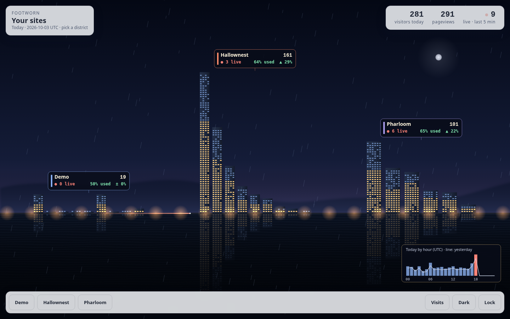
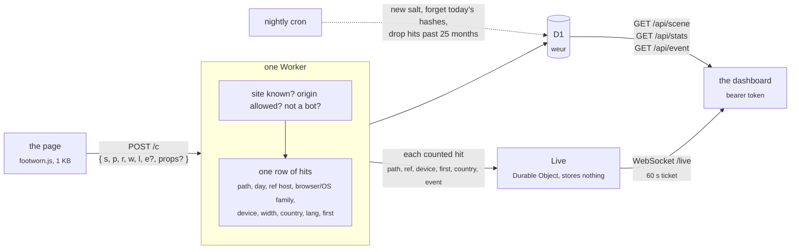

<h1 align="center">Footworn</h1>

<p align="center">
  A visit counter for static sites that sets no cookies, keeps no IP and needs no consent banner.<br>
  One Cloudflare Worker on the free plan: the collector, a 1&nbsp;KB tracker, a D1 database, a JSON API and a live dashboard: a bay at night where every site is a district and every visit a light on the shore.
</p>

<p align="center">
  <a href="https://github.com/betorzdev/footworn/actions/workflows/ci.yml"></a>
  
  
  
</p>



<p align="center"><sub>The bay: one district per site, every page a tower, all on one scale, live. Click one to look closer.</sub></p>

## Why

- **No banner.** Its whole data model is the regulator’s list of what audience measurement may
  keep without consent (Spain’s LSSI 22.2 as the AEPD reads it, the CNIL’s line). No cookies, no
  storage in the browser, no IP, no User-Agent, no fingerprint. [`docs/privacy.md`](docs/privacy.md)
  maps every stored column to that list.
- **A glance, and a show.** The busiest site is the tallest district; the busiest page, the
  tallest tower; warm windows are the loads that were used. Every visit arrives as a light the
  moment it is counted. The ledger beside it has the plain numbers: totals with their change, a
  day chart, when people come and on what screens, the top of each dimension.
- **Events with properties.** `footworn.event('screen', { view: 'combat', lang: 'es' })` and the
  dashboard breaks it down by day, by page and by each property.
- **Free and tiny.** The Workers Free plan has room for about 50 000 pageviews a day. The
  tracker is 1 KB, the Worker has zero runtime dependencies, the dashboard is a few plain files
  (a 2D canvas, no WebGL) behind a strict CSP: no framework, no build.
- **It never breaks the host page.** Everything the tracker does is inside `try/catch`;
  `sendBeacon` first, `fetch keepalive` after; a hit that isn’t valid is dropped with a silent `204`.

## What you see

**A site, up close.** Click a district and the camera closes in on its skyline: a tower per
page (the 30-day top 8, and *other pages*), from today's busiest to its quietest, its height
today's pageviews and the sign on its roof the count. The windows are lit warm from the ground
up for the share of loads where the page was *used* (a tap, a key or 10 s in view), cool for the
rest, and a tick on the side gives that share. On the street, a lane per referrer (the top five,
then *elsewhere* and *direct*) with today's arrivals. Every pageview is a car that drives its
lane to its tower, with a trail in the lane's colour; every event, a searchlight over the roof.
Hover, or tap, a tower or a lane for its numbers. At UTC midnight (the day's cut) the windows go
dark from the top down and the day starts again.


**Today, one by one.** A panel beside the scene, in two tabs. *Visits* lists the day's
pageviews as they come in, newest first, and makes a visit (the first page of someone's day)
stand out: its referrer's lane colour, the page, where it came from, the country and the device;
another page steps back, and *Only visits* hides those. Point at a row and the scene rings its
tower and its lane; click it and it unfolds with everything it holds (country, device, browser
and system, language) and today's counts around it: its page's pageviews and used share, its
referrer, its country and its device. *Events* has a card per event with today's count, the
spread of its commonest property, when it last happened and a link to its detail in the ledger. Rounded on
purpose, so a row is never a fingerprint (no width, no second, nothing joining two rows, so a
page is never hung under a visit), and gone at UTC midnight.


**The ledger.** A drawer with the numbers behind the scene, for any range: totals with their
change, pageviews and visitors by day, by hour or weekday, screen widths, the top 30 of each
dimension (pages, referrers, events, countries, languages, browsers, systems, devices), the share
of loads where the page was *used* (a tap, a key or 10 s in view; per range and per page), and an
event opened with its pages and properties. Every chart has its numbers in a table under `Data`,
which makes the ledger the scene's text alternative too. The view lives in the URL:
`/?site=your-site&ledger=1&days=30&event=screen` is a link straight to it.


**On a phone.** The shore scrolls sideways when the districts don't fit; tap for the numbers. The panels and the ledger follow the system's light or dark scheme, and the Dark/Light
button overrides it.

<p align="center">
  
</p>

## Wire a site

```html
<script async src="https://footworn.<account>.workers.dev/footworn.js" data-site="your-site"></script>
```

That counts a pageview on load. From the page’s own code:

```js
footworn.event('screen', { view: 'combat', lang: 'es' });   // an action, with up to 10 short properties
footworn.count('/other-page/');                              // a pageview by hand (hash routing, say)
```

On its own it also sends `$engaged` once per load, at the first tap or key or after 10 s in view:
the dashboard's *used* rate. Event names starting with `$` are reserved.

Tag the links you post where apps send no referrer (Discord, the Reddit and YouTube apps):
`https://your-site.example/?ref=discord` arrives as *discord* in place of *direct*. `?utm_source=`
works too. Only known channels are kept (`CHANNELS` in `src/collect.js`: reddit, discord,
youtube, steam, email…); any other value is ignored, so a personal referral code never lands.

The script sends nothing over `file://`, on localhost (unless `data-local="1"`), inside an
iframe, or from a browser driven by automation; `data-auto="0"` skips the pageview on load (and
the `$engaged` with it).
Without the script (blocked, offline) `window.footworn` is undefined, so call it as
`window.footworn && footworn.event(...)`.

The site has to be registered with its allowed origins, or its hits are dropped:

```sh
npm run site:add -- your-site "Your Site" https://your-site.example --remote
```

## How a visit flows



The IP and the User-Agent are read once, to derive browser and OS families and the daily
“first pageview” flag (a SHA-256 of a random daily salt, the site, the IP and the User-Agent,
kept only until midnight), and are never written anywhere.

## Run it locally

```sh
npm install
npm run dev                           # http://localhost:8787
```

`npm run dev` prepares what is missing (a `.dev.vars` with a random token, the local D1, the
`demo` site) and prints the dashboard link with the token; `tools/dev.js` is the recipe.

- `/demo` fires a pageview and has buttons for events.
- `/` is the dashboard. Paste the token from `.dev.vars`, or open `/#token=…` once: it’s saved in
  the browser and the URL is cleaned. The view lives in the query, so `/?site=<id>` or
  `/?site=<id>&ledger=1&from=…&to=…&event=<name>` is a link to it. Keep `/demo` open in another
  tab to watch the hits come in.
- `/privacy` is the public notice.
- `curl http://localhost:8787/cdn-cgi/local/scheduled` runs the nightly cron by hand.

`npm test` is the unit suite, `npm run smoke` the end-to-end run (a throwaway local D1 through
`wrangler dev`); `.github/workflows/ci.yml` runs both on every push. `.claude/` holds the hooks
that keep the rules in `CLAUDE.md` (tests after every edit under `src/`, no deploys or commits
from the agent, `docs/privacy.md` changes with what is stored) and the skill that runs the app
locally for `/verify`.

## Deploy (once)

1. A Cloudflare account (the Workers Free plan asks for no card) and `npx wrangler login`.
2. `npx wrangler d1 create footworn --location weur` and paste the printed `database_id` into
   `wrangler.toml` (keep `weur`: the data stays in Western Europe).
3. `npm run migrate` (applies `migrations/` to the remote database).
4. `npx wrangler secret put ADMIN_TOKEN` (a long random string; it’s the dashboard’s password).
5. `npm run deploy` → `https://footworn.<account>.workers.dev`.
6. Register each site with `npm run site:add -- <id> "<name>" "<origin> [<origin>…]" --remote`.

Free plan room: 100 000 requests/day and 100 000 D1 writes/day; a pageview costs two writes and
an event one, so about 50 000 pageviews a day. The live view adds one Durable Object request per
counted hit (100 000 a day on the free plan, the same ceiling); an open dashboard's socket
hibernates between hits and costs nothing while idle. The first `npm run deploy` creates the
Durable Object (the `[[migrations]]` in `wrangler.toml`). Retention is `RETENTION_MONTHS` in
`wrangler.toml` (25, the AEPD’s cap).

## Privacy

| Stored, per hit | Why it is allowed |
|---|---|
| `path`, `day` | audience, page by page |
| `ref` (hostname, or the link's `?ref=` tag) | where a link was followed from |
| `browser`, `os`, `device`, `width` | device type, browser and screen size |
| `event`, `props` | actions on the page; `$engaged`, the page was used and not just opened |
| `country` | geographic area, from the edge |
| `lang` | the browser’s language setting |
| `first` | the daily visitor flag: a count, not an identifier |

Not stored, ever: cookies, local storage, IP, User-Agent, any hash or id, any sequence of pages
one person saw. Today's visits are listed one by one, rounded (the minute, the device class, never
the width, no id), live and as the day's history; earlier days are only counts. `/privacy` is the notice a host site links to;
[`docs/privacy.md`](docs/privacy.md) is the full record, and it changes together with the schema.

<p align="center">
  
</p>

## API

`Authorization: Bearer <ADMIN_TOKEN>`; dates `YYYY-MM-DD`, UTC; default range the last 30 days.

| | |
|---|---|
| `GET /api/sites` | `[{ id, name }]` |
| `GET /api/scene?site=` | what the bay draws, all counts: `pages` and `refs` (30-day top 8 and top 5, `[{ value, hits }]`), `today: { hits, visitors, events, loads, engaged, pages: [{ path, hits, loads, engaged, events }], refs: [{ ref, hits }] }` (the used rate is `engaged / loads`, as in `/api/stats`), `live` (pageviews in the last 5 minutes), `yesterday: { visitors }` up to this time of day, and `hours: [{ hour, today, yesterday }]`, pageviews by UTC hour |
| `GET /api/visits?site=` | today's visits (UTC), newest first, at most 2000, rounded: `{ day, now, visits: [{ minute, path, ref, device, browser, os, lang, country, first, event, props }] }`. Never the width, the second or an id |
| `GET /api/live-ticket` | `{ ticket }`, good for 60 s, to open the live socket |
| `GET /live?ticket=` | WebSocket: one JSON message per counted hit, `{ site, t, path, ref, device, browser, os, lang, first, country, event, props }`; send `ping`, get `pong` |
| `GET /api/stats?site=&from=&to=` | `{ totals: { hits, visitors, events, loads, engaged }, days: [{ day, hits, visitors, events, engaged }], path, ref, browser, os, device, country, lang, events }`, each dimension `[{ value, hits, visitors }]` (`path` adds `loads` and `engaged`), top 30. `events` never counts `$engaged`; `loads` are the pageviews since the site's first `$engaged`, what the *used* rate divides by. Also `hours: [{ hour, hits }]` (UTC), `weekdays: [{ weekday, hits }]` (0 is Sunday), `widths: [{ bucket, hits }]` (100 px buckets, pageviews only) and `previous: { from, to, hits, visitors, events, loads, engaged }`, the totals of the period of the same length just before. |
| `GET /api/event?site=&name=&from=&to=` | `{ totals, days, paths, props: { key: [{ value, hits }] } }` |
| `POST /c` | what the tracker sends: `{ s, p, r, w, l, e?, props? }`, under 8 KB; always `204` |

## Layout

```
src/index.js      the Worker: /c, /api/*, /live, the nightly cron (export default { fetch, scheduled }, export { Live })
src/collect.js    a posted body → a row of hits (validation, referrer, device, props)
src/ua.js         User-Agent → browser/OS families; the bot filter
src/visitor.js    the daily salt and the "first today" flag
src/stats.js      the API's queries
src/live.js       the live view: what a live message carries, and the Live Durable Object that relays it
src/ticket.js     the live socket's 60-second ticket
src/auth.js       the bearer check
public/           footworn.js, the dashboard (index.html, app.js, city.js, live.js, ledger.js, theme.js, style.css, tokens.css), privacy, demo,
                  _headers (nosniff and no-referrer everywhere; the dashboard's CSP: no inline code, no framing)
migrations/       the D1 schema
test/             node --test
tools/            dev.js, site-add.js, smoke.js
docs/             privacy.md (the record of what is stored), backlog.md, screenshots/
```
