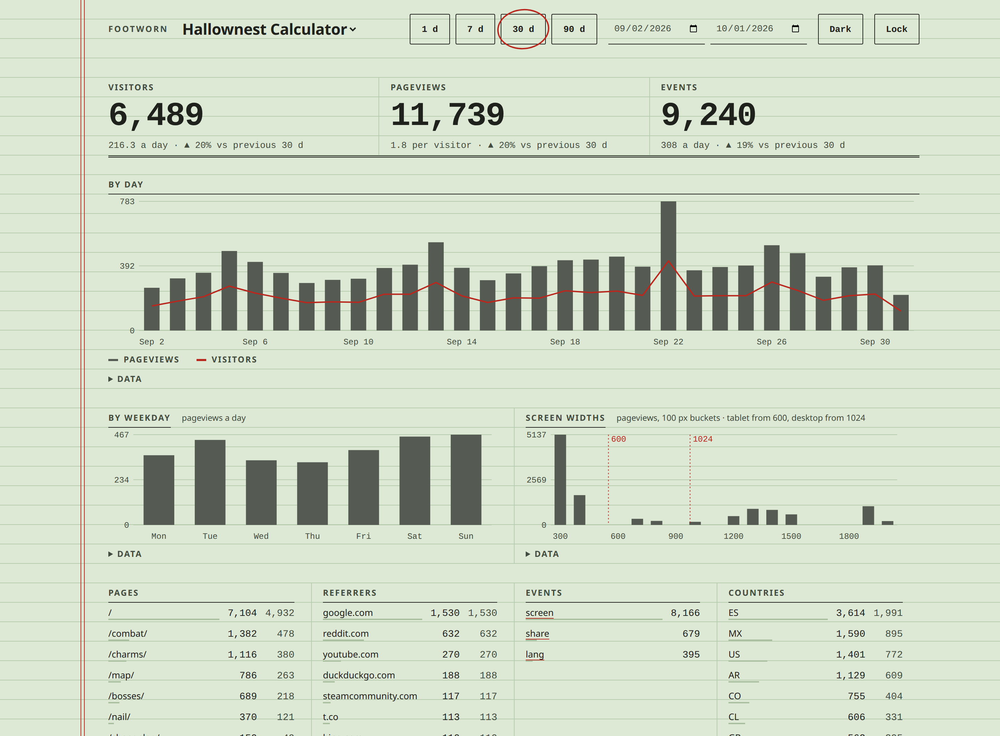
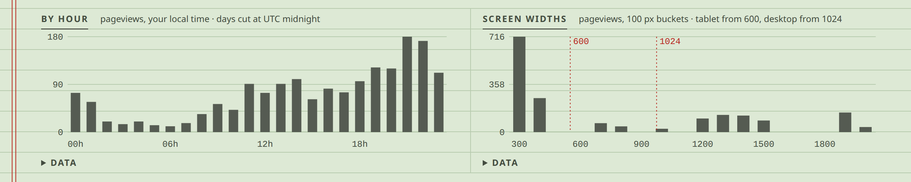
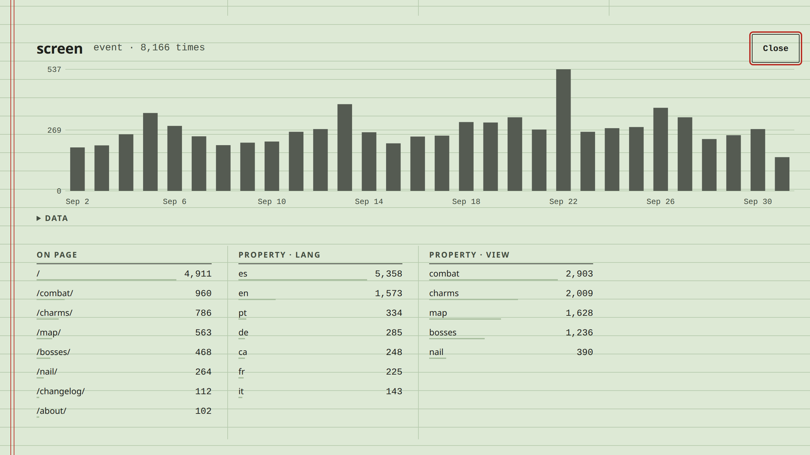
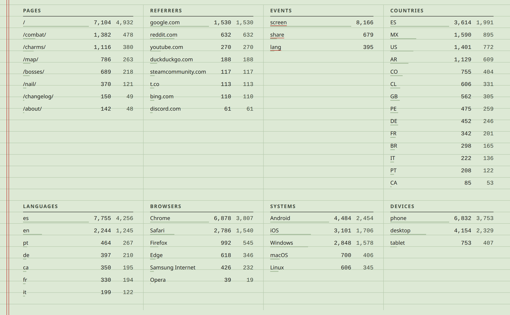
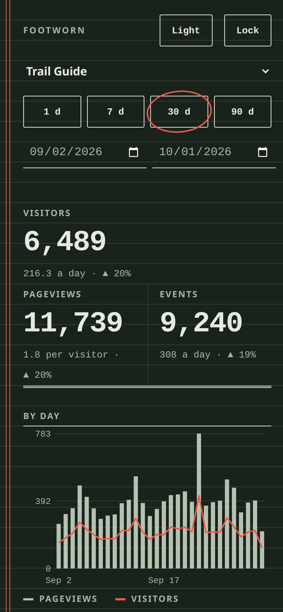
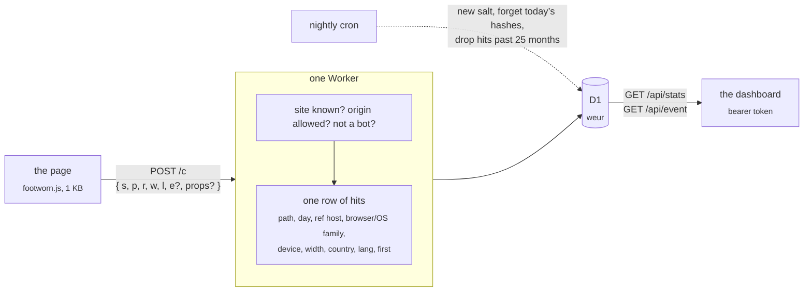

<h1 align="center">Footworn</h1>

<p align="center">
  A visit counter for static sites that sets no cookies, keeps no IP and needs no consent banner.<br>
  One Cloudflare Worker on the free plan: the collector, a 1&nbsp;KB tracker, a D1 database, a JSON API and a dashboard.
</p>

<p align="center">
  <a href="https://github.com/betorzdev/footworn/actions/workflows/ci.yml"></a>
  
  
  
</p>



<p align="center"><sub>The dashboard, on a month of one site. It follows your system’s light or dark scheme.</sub></p>

## Why

- **No banner.** Its whole data model is the regulator’s list of what audience measurement may
  keep without consent (Spain’s LSSI 22.2 as the AEPD reads it, the CNIL’s line). No cookies, no
  storage in the browser, no IP, no User-Agent, no fingerprint. [`docs/privacy.md`](docs/privacy.md)
  maps every stored column to that list.
- **A glance, not a session.** Totals with their change, a day chart, when people come and on
  what screens, the top of each dimension. Nothing to configure, nothing to click through.
- **Events with properties.** `footworn.event('screen', { view: 'combat', lang: 'es' })` and the
  dashboard breaks it down by day, by page and by each property.
- **Free and tiny.** The Workers Free plan has room for about 50 000 pageviews a day. The
  tracker is 1 KB, the Worker has zero runtime dependencies, the dashboard is a few plain files
  behind a strict CSP: no framework, no build.
- **It never breaks the host page.** Everything the tracker does is inside `try/catch`;
  `sendBeacon` first, `fetch keepalive` after; a hit that isn’t valid is dropped with a silent `204`.

## What you see

**When people come, and on what screens.** By hour of the day (in your local time) on a week or
less, by weekday on a longer range; screen widths in 100 px buckets, with the phone, tablet and
desktop cut-offs drawn in.



**One event, opened.** An event name in the Events table opens its own panel: a day chart, the
pages it fired on, and every property with its values. The view lives in the URL, so
`/?site=your-site&days=30&event=screen` is a link straight to it.



**Every dimension, top 30.** Pages, referrers, events, countries, languages, browsers, systems,
devices: count and visitors, with a bar under each value. Every chart also has its numbers in a
table under a `Data` toggle, for screen readers and copy-paste.



**On a phone, in both schemes.** The pages follow the system; the dashboard’s Dark/Light button
overrides it, and the choice is kept in the browser, like the token.

<p align="center">
  
  &nbsp;&nbsp;
  
</p>

## Wire a site

```html
<script async src="https://footworn.<account>.workers.dev/footworn.js" data-site="your-site"></script>
```

That counts a pageview on load. From the page’s own code:

```js
footworn.event('screen', { view: 'combat', lang: 'es' });   // an action, with up to 10 short properties
footworn.count('/other-page/');                              // a pageview by hand (hash routing, say)
```

The script sends nothing over `file://`, on localhost (unless `data-local="1"`), inside an
iframe, or from a browser driven by automation; `data-auto="0"` skips the pageview on load.
Without the script (blocked, offline) `window.footworn` is undefined, so call it as
`window.footworn && footworn.event(...)`.

The site has to be registered with its allowed origins, or its hits are dropped:

```sh
npm run site:add -- your-site "Your Site" https://your-site.example --remote
```

## How a visit flows



The IP and the User-Agent are read once, to derive browser and OS families and the daily
“first pageview” flag (a SHA-256 of a random daily salt, the site, the IP and the User-Agent,
kept only until midnight), and are never written anywhere.

## Run it locally

```sh
npm install
npm run dev                           # http://localhost:8787
```

`npm run dev` prepares what is missing (a `.dev.vars` with a random token, the local D1, the
`demo` site) and prints the dashboard link with the token; `tools/dev.js` is the recipe.

- `/demo` fires a pageview and has buttons for events.
- `/` is the dashboard. Paste the token from `.dev.vars`, or open `/#token=…` once: it’s saved in
  the browser and the URL is cleaned. The view lives in the query, so `/?site=<id>&days=7` or
  `/?site=<id>&from=…&to=…&event=<name>` is a link to it.
- `/privacy` is the public notice.
- `curl http://localhost:8787/cdn-cgi/local/scheduled` runs the nightly cron by hand.

`npm test` is the unit suite, `npm run smoke` the end-to-end run (a throwaway local D1 through
`wrangler dev`); `.github/workflows/ci.yml` runs both on every push. `.claude/` holds the hooks
that keep the rules in `CLAUDE.md` (tests after every edit under `src/`, no deploys or commits
from the agent, `docs/privacy.md` changes with what is stored) and the skill that runs the app
locally for `/verify`.

## Deploy (once)

1. A Cloudflare account (the Workers Free plan asks for no card) and `npx wrangler login`.
2. `npx wrangler d1 create footworn --location weur` and paste the printed `database_id` into
   `wrangler.toml` (keep `weur`: the data stays in Western Europe).
3. `npm run migrate` (applies `migrations/` to the remote database).
4. `npx wrangler secret put ADMIN_TOKEN` (a long random string; it’s the dashboard’s password).
5. `npm run deploy` → `https://footworn.<account>.workers.dev`.
6. Register each site with `npm run site:add -- <id> "<name>" "<origin> [<origin>…]" --remote`.

Free plan room: 100 000 requests/day and 100 000 D1 writes/day; a pageview costs two writes and
an event one, so about 50 000 pageviews a day. Retention is `RETENTION_MONTHS` in
`wrangler.toml` (25, the AEPD’s cap).

## Privacy

| Stored, per hit | Why it is allowed |
|---|---|
| `path`, `day` | audience, page by page |
| `ref` (hostname only) | where a link was followed from |
| `browser`, `os`, `device`, `width` | device type, browser and screen size |
| `event`, `props` | actions on the page |
| `country` | geographic area, from the edge |
| `lang` | the browser’s language setting |
| `first` | the daily visitor flag: a count, not an identifier |

Not stored, ever: cookies, local storage, IP, User-Agent, any hash or id, any sequence of pages
one person saw. `/privacy` is the notice a host site links to;
[`docs/privacy.md`](docs/privacy.md) is the full record, and it changes together with the schema.

<p align="center">
  
</p>

## API

`Authorization: Bearer <ADMIN_TOKEN>`; dates `YYYY-MM-DD`, UTC; default range the last 30 days.

| | |
|---|---|
| `GET /api/sites` | `[{ id, name }]` |
| `GET /api/stats?site=&from=&to=` | `{ totals: { hits, visitors, events }, days: [{ day, hits, visitors, events }], path, ref, browser, os, device, country, lang, events }`, each dimension `[{ value, hits, visitors }]`, top 30. Also `hours: [{ hour, hits }]` (UTC), `weekdays: [{ weekday, hits }]` (0 is Sunday), `widths: [{ bucket, hits }]` (100 px buckets, pageviews only) and `previous: { from, to, hits, visitors, events }`, the totals of the period of the same length just before. |
| `GET /api/event?site=&name=&from=&to=` | `{ totals, days, paths, props: { key: [{ value, hits }] } }` |
| `POST /c` | what the tracker sends: `{ s, p, r, w, l, e?, props? }`, under 8 KB; always `204` |

## Layout

```
src/index.js      the Worker: /c, /api/*, the nightly cron (export default { fetch, scheduled })
src/collect.js    a posted body → a row of hits (validation, referrer, device, props)
src/ua.js         User-Agent → browser/OS families; the bot filter
src/visitor.js    the daily salt and the "first today" flag
src/stats.js      the API's queries
src/auth.js       the bearer check
public/           footworn.js, the dashboard (index.html, app.js, theme.js, style.css, tokens.css), privacy, demo,
                  _headers (nosniff and no-referrer everywhere; the dashboard's CSP: no inline code, no framing)
migrations/       the D1 schema
test/             node --test
tools/            dev.js, site-add.js, smoke.js
docs/             privacy.md (the record of what is stored), backlog.md, screenshots/
```
