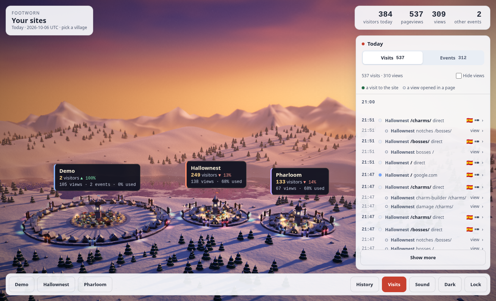
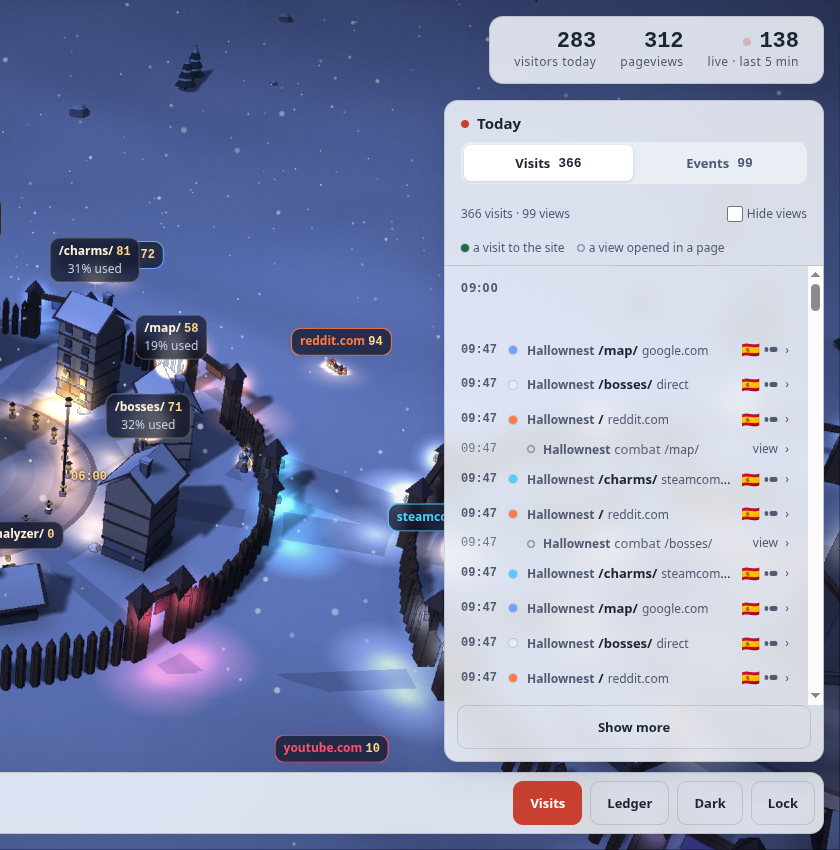
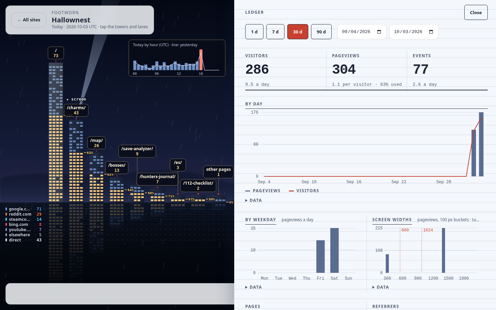
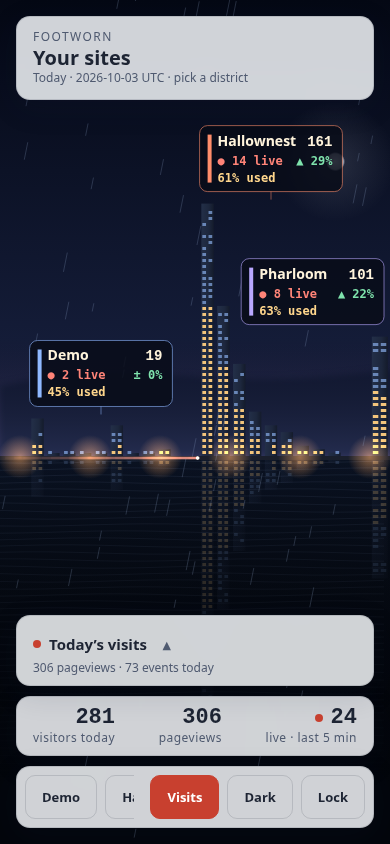
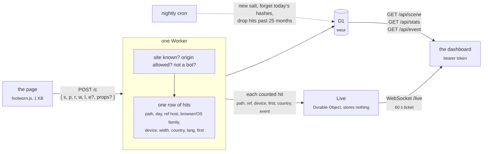
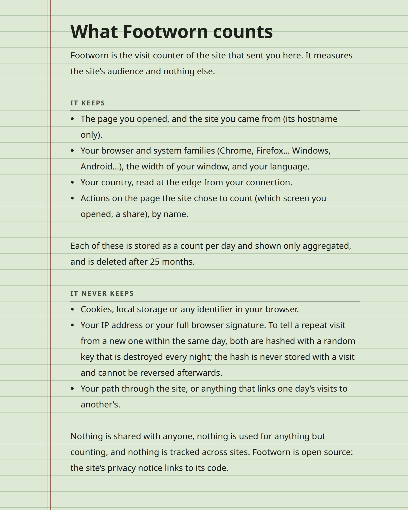

<h1 align="center">Footworn</h1>

<p align="center">
  A visit counter for static sites that sets no cookies, keeps no IP and needs no consent banner.<br>
  One Cloudflare Worker on the free plan: the collector, a 1&nbsp;KB tracker, a D1 database, a JSON API and a live dashboard: a snowed-in city on a polar winter day, where every site is a quarter, every page a house and every visit a villager walking home.
</p>

<p align="center">
  <a href="https://github.com/betorzdev/footworn/actions/workflows/ci.yml"></a>
  
  
  
</p>



<p align="center"><sub>The valley: one village per site, every page a house, all on one scale, live. Click one to look closer.</sub></p>

## Why

- **No banner.** Its whole data model is the regulator’s list of what audience measurement may
  keep without consent (Spain’s LSSI 22.2 as the AEPD reads it, the CNIL’s line). No cookies, no
  storage in the browser, no IP, no User-Agent, no fingerprint. [`docs/privacy.md`](docs/privacy.md)
  maps every stored column to that list.
- **A glance, and a show.** The busiest page anywhere is the tallest house; warm windows are
  the loads that were used; the street lamps round each square are the day hour by hour. Every
  visit arrives as a villager walking in the moment it is counted. The ledger beside it has the plain numbers: totals with their change, a
  day chart, when people come and on what screens, the top of each dimension.
- **Events with properties.** `footworn.event('screen', { view: 'combat', lang: 'es' })` and the
  dashboard breaks it down by day, by page and by each property.
- **Free and tiny.** The Workers Free plan has room for about 50 000 pageviews a day. The
  tracker is 1 KB, the Worker has zero runtime dependencies, the dashboard is a few plain files
  (hand-written WebGL2, no 3D library) behind a strict CSP: no framework, no build.
- **Cheap to leave open.** The scene is drawn once and kept, with everything costly (lens, glow,
  shadows, sky) in that one drawing; while only the snow moves the dashboard shows 30 light
  frames a second and runs the sky's passes again once every four seconds, so the sky moves on;
  with reduced motion on, no frames at all until a visit comes or the light has changed.
- **A sky that follows your clock.** A polar winter day: a low golden sun at midday, dusk, the
  blue hour, the night and its aurora, dawn. The sun never gets high, so the lit windows always
  read. `?hour=13.5` in the address holds the clock there.
- **It never breaks the host page.** Everything the tracker does is inside `try/catch`;
  `sendBeacon` first, `fetch keepalive` after; a hit that isn’t valid is dropped with a silent `204`.

## What you see

**One city.** Every site is a quarter of one walled city in the valley: the busiest in the
middle, the smaller ones behind it, packed together. One wall runs round them all, each
quarter's stretch in its own kit, and none between them; an avenue runs from square to square
between two quarters that touch, and the snow between them is filled with the city's own low,
pale, shuttered houses, which are no count.

**A quarter, up close.** Click a quarter (or its sign) and the camera flies in. Round the clock
square, a house per page (every page of the last 7 days, the busiest at twelve o'clock):
its storeys are today's pageviews, on one scale for every site, and its windows (on every side)
are lit warm from the ground up for the share of loads where the page was *used* (a tap, a key
or 10 s in view); the label over the roof gives the pageviews, pointing at it gives both. A brass band on its front marks
yesterday's storeys up to this time (a rod over the roof when yesterday was taller), and the way
to its door is as wide and worn as today's visits, with their footprints. A page nobody opened
today is shuttered, its lamp out. Round the square, 24 street lamps, one per UTC hour
clockwise from midnight at the top: each as tall as that hour's pageviews, with a brass ring at
yesterday's, the current one glowing. In the wall, where the quarter faces the valley, a gate
per referrer (every one of the last 7 days, then *direct*), as wide as today's arrivals, its
lanterns in the referrer's colour. A referrer that is another of your sites (one of its
origins) is no gate: it is the avenue from that site's quarter, with lanterns in its colour
where it comes in. The clock on the tower tells the UTC time on a
24-hour dial, like the ring of lamps: midnight at the top.
Between the lamps and the tower, a market: a stall per view opened inside a page (a `screen`
event with a `view`; every one of the last 7 days), with a pole beside it whose
green lanterns light up from the ground with today's opens, on one scale for every site; a stall
nobody opened today is boarded up. Behind the houses, a workshop per other event of the site
(every one of the last 7 days that is no view; in the calculators, `lang`): a woodshed, a
well, a forge, a windmill, a bread oven or a granary, picked by the event's name so it never
turns into another, its lantern in the event's colour and lit when it was done today, and a
crate in front for today's (on one scale for every site). Nothing is grouped. Ten stalls
stand round the tower, the next sixteen in a row behind them, and so on; the houses stand on
one ring while they fit, then on rings behind it (the week's busiest pages inside), the
workshops behind them, and a page, referrer, view or event first seen today builds its house,
gate, stall or workshop there and then.
A label rides over what had visits today only, and where two would overlap the busier one
stays; pointing at a house, gate, stall or workshop always tells its numbers, and a live visit
lifts a "+1" on its gate and then on its house (or stall, or workshop) as it gets there.
A quarter is as big as its site's visits: it widens a step for every three times as many
pageviews and views in the last 7 days (from 3 a week up to 10 000), and a site with more
of them than another always has the wider quarter, whatever its pages; what is left before
its edge is the city's own houses, with no count in them.
Every pageview is a villager with a scarf in that colour who walks in through the gate (or,
from another of your sites, from that quarter's square along the avenues: someone on Hallownest
who follows its link to Pharloom is seen crossing the city), across the square and into the house, leaving steps in the snow that fade in a minute; every view opened, one in a green scarf who leaves that page's
house for the stall; every other event, one in a scarf of the workshop's colour who walks from
that page's house to its workshop, works there a moment (sparks at the forge, steam at the well)
and leaves a crate. Drag to turn, wheel or
pinch to come closer; hover, or tap, a house, a gate, a stall or a workshop for its numbers. At UTC midnight
(the day's cut) the windows go dark from the top down and the day starts again.

**Sound**, off until its button in the dock asks for it, says the same for the ear, for a
dashboard left on a second screen: two steps in the snow when a villager comes through a gate
(each gate has its own, darker or brighter), a hand bell when they reach the house (the page is
the pitch, the top page the lowest; a new visitor's bell is answered an octave up), a wind chime
at the stall, three knocks of work at a workshop, and one stroke of the tower at UTC midnight. Each quarter
sounds from its side of the city. All of it is synthesised in the browser (Web Audio, no
files); nothing plays between visits, and the audio goes to sleep a few seconds after the last
one. With sound on, point at the button, or reach it with Tab, and its volume slider comes up.
Not on a phone.


**Today, one by one.** A panel beside the scene, in two tabs. *Visits* lists every visit to the
site (a page load) as it comes in, newest first: its referrer's gate colour, the page, where it
came from, the country and the device. Between them, stepped back, every view opened inside a
page (a `screen` event with a `view`: "charms", "game"), in the order they came; they sit together
because they arrived together, never because anything ties them, and *Hide views* leaves the
visits alone. Point at a row and the scene rings its
house and its gate; click it and it unfolds with everything it holds (country, device, browser
and system, language, whether it was the first page of that visitor's day; a view's page and
properties) and today's counts around it: its page's pageviews and used share, its referrer or
how often that view was opened, its country and its device. *Events* is the same list, one row
per event in its own colour with its properties, under a pill per event name with today's count
(press one or several to list only those); an open event links to its detail in the ledger.
Every row names its site. Rounded on purpose, so a row is never a fingerprint (no width, no
second, nothing joining two rows, so a view is never hung under a visit), and gone at UTC midnight.



**Another day.** *History* in the dock brings up a strip of the last 60 days over it, a bar per
day as tall as its visitors (today's hollow: still being counted). Press a bar, step with `‹ ›`
or the arrow keys, or type any day in the date field, and the village is turned back to that
day as it ended: its houses, gates, stalls and workshops are those of the 7 days up to it, its storeys,
windows, lanterns and totals that day's, every lamp lit with the day before as the brass ring,
and nobody walks in. Over the valley the bars add every site up. A past day is counts only: the
panel of visits says so and opens that day in the ledger. `Today` (or putting the strip away)
comes back to the live village; `&day=2026-09-24` in the URL is a link to a day.

**The ledger.** A drawer with the numbers behind the scene, for any range: totals with their
change, pageviews and visitors by day, by hour or weekday, screen widths, the top 30 of each
dimension (pages, referrers, events, countries, languages, browsers, systems, devices), the share
of loads where the page was *used* (a tap, a key or 10 s in view; per range and per page), and an
event opened with its pages and properties. Every chart has its numbers in a table under `Data`,
which makes the ledger the scene's text alternative too. The view lives in the URL:
`/?site=your-site&ledger=1&days=30&event=screen` is a link straight to it.



**On a phone.** Drag to turn the valley, pinch to come closer, tap for the numbers. The panels and the ledger follow the system's light or dark scheme, and the Dark/Light
button overrides it.

<p align="center">
  
</p>

## Wire a site

```html
<script async src="https://footworn.<account>.workers.dev/footworn.js" data-site="your-site"></script>
```

That counts a pageview on load; a reload counts only if it is that visitor's first pageview of the day (a tab left open overnight), otherwise it is the same visit again. From the page’s own code:

```js
footworn.event('screen', { view: 'combat', lang: 'es' });   // an action, with up to 10 short properties
footworn.count('/other-page/');                              // a pageview by hand (hash routing, say)
```

An app that changes view without loading a page (tabs, screens) can send
`footworn.event('screen', { view: 'charms' })`: an event named `screen` with a `view` is listed in
the dashboard's Visits tab as a view opened in a page, between the visits.

On its own it also sends `$engaged` once per load (never on a reload), at the first tap or key or after 10 s in view:
the dashboard's *used* rate. Event names starting with `$` are reserved.

Tag the links you post where apps send no referrer (Discord, the Reddit and YouTube apps):
`https://your-site.example/?ref=discord` arrives as *discord* in place of *direct*. `?utm_source=`
works too. Only known channels are kept (`CHANNELS` in `src/collect.js`: reddit, discord,
youtube, steam, email…); any other value is ignored, so a personal referral code never lands.

The script sends nothing over `file://`, on localhost (unless `data-local="1"`), inside an
iframe, or from a browser driven by automation; `data-auto="0"` skips the pageview on load (and
the `$engaged` with it).
Without the script (blocked, offline) `window.footworn` is undefined, so call it as
`window.footworn && footworn.event(...)`.

The site has to be registered with its allowed origins, or its hits are dropped. **Sites** in
the dashboard's dock does it: *Add a site*, a name (the id follows it, fixed once saved), the
origins its pages are served from, and its village's look, which stands in the valley as a draft
village while you choose it. The kit: `alpine` (the default: timber, a palisade), `stone` (pale
stone, slate spires, a rampart with round towers, cold lamps), `citadel` (red roofs, a belfry,
battlements) or `umbra` (near-black slate, an iron fence, pale light, motes drifting over it, and
a village that casts its own shade). Each piece of it can be set apart from the kit, to mix kits:
the spire, the wall, the roofs, the village's shade and its motes (a stone village with an iron
fence, say). Its palette can be turned round the hue wheel and made lighter or darker (roofs,
walls, shutters; never the lamps and windows, which are counts), and the site gets one of eight
colours for its pennant, its sign and its banner's band. The counts read the same in each.
*Suggest from the site* proposes all of it from the site's own page: colour rules on its theme
colour, its colour scheme and its icon (free, always there: a theme near black gives umbra, a warm
colour citadel, greys stone), and, when the Worker has an `ANTHROPIC_API_KEY` secret, Claude's
reading of its title, description, icon and preview image, which sees the mood as well as the
colours. It fills the form and the village previews it; nothing is saved until you save, and the
icon it found is kept with the site. Once saved, the site's card opens on **Wire**: what its own repository needs
(the tag on every page, a guarded `track()` helper for views and actions, a line in its privacy
notice, its Content-Security-Policy, tagged links, a mention in its docs), each with its snippet,
and *Copy the prompt for your agent*, the same steps as a prompt for a coding agent opened in that
repository, which reads the code and proposes what to track before adding it. A line under it
waits for the site's first visit on the live socket and turns green when it comes. The site can also fly its own icon
on its tower and show it on its sign: *Fetch from the site* reads its page (its
`<link rel="icon">`, the largest up to 256 px, else `/favicon.ico`), *Choose a file…* takes one;
either way a PNG, ICO or JPEG of 40 KB or less, never an SVG, served to the dashboard by the
Worker. *Edit* changes any of it later (the village is dressed again as you go, *Cancel* puts it
back); *Remove site…* asks for the id and removes the site with everything counted for it.

From a shell, the same without the look's colour and turn (`npm run dev` and the smoke test use these):

```sh
npm run site:add -- your-site "Your Site" https://your-site.example --style stone --remote
npm run site:icon -- your-site --remote            # or: … your-site https://your-site.example/page/ --remote
```

## How a visit flows



The IP and the User-Agent are read once, to derive browser and OS families and the daily
“first pageview” flag (a SHA-256 of a random daily salt, the site, the IP and the User-Agent,
kept only until midnight), and are never written anywhere.

## Run it locally

```sh
npm install
npm run dev                           # http://localhost:8787
```

`npm run dev` prepares what is missing (a `.dev.vars` with a random token, the local D1, the
`demo` site) and prints the dashboard link with the token; `tools/dev.js` is the recipe.

- `/demo` fires a pageview and has buttons for events.
- `/` is the dashboard. Paste the token from `.dev.vars`, or open `/#token=…` once: it’s saved in
  the browser and the URL is cleaned. The view lives in the query, so `/?site=<id>` or
  `/?site=<id>&ledger=1&from=…&to=…&event=<name>` is a link to it. Keep `/demo` open in another
  tab to watch the hits come in.
- `/privacy` is the public notice.
- `curl http://localhost:8787/cdn-cgi/local/scheduled` runs the nightly cron by hand.

`npm test` is the unit suite, `npm run smoke` the end-to-end run (a throwaway local D1 through
`wrangler dev`); `.github/workflows/ci.yml` runs both on every push. `.claude/` holds the hooks
that keep the rules in `CLAUDE.md` (tests after every edit under `src/`, no deploys or commits
from the agent, `docs/privacy.md` changes with what is stored) and the skill that runs the app
locally for `/verify`.

## Deploy (once)

1. A Cloudflare account (the Workers Free plan asks for no card) and `npx wrangler login`.
2. `npx wrangler d1 create footworn --location weur` and paste the printed `database_id` into
   `wrangler.toml` (keep `weur`: the data stays in Western Europe).
3. `npm run migrate` (applies `migrations/` to the remote database).
4. `npx wrangler secret put ADMIN_TOKEN` (a long random string; it’s the dashboard’s password).
5. `npm run deploy` → `https://footworn.<account>.workers.dev`.
6. Open the dashboard with the token and register each site from **Sites** (or `npm run site:add -- <id> "<name>" "<origin> [<origin>…]" --remote`).
   A database made before the Sites panel needs `npm run migrate` again (`0003_site_look.sql`, `0004_site_pieces.sql`).
7. Optional: `npx wrangler secret put ANTHROPIC_API_KEY` for Claude's suggestions in the Sites panel
   (one call per *Suggest*, model `claude-opus-5-5`, low effort; without it the colour rules answer alone).

Free plan room: 100 000 requests/day and 100 000 D1 writes/day; a pageview costs two writes and
an event one, so about 50 000 pageviews a day. The live view adds one Durable Object request per
counted hit (100 000 a day on the free plan, the same ceiling); an open dashboard's socket
hibernates between hits and costs nothing while idle. The first `npm run deploy` creates the
Durable Object (the `[[migrations]]` in `wrangler.toml`). Retention is `RETENTION_MONTHS` in
`wrangler.toml` (25, the AEPD’s cap).

## Privacy

| Stored, per hit | Why it is allowed |
|---|---|
| `path`, `day` | audience, page by page |
| `ref` (hostname, or the link's `?ref=` tag) | where a link was followed from |
| `browser`, `os`, `device`, `width` | device type, browser and screen size |
| `event`, `props` | actions on the page; `$engaged`, the page was used and not just opened |
| `country` | geographic area, from the edge |
| `lang` | the browser’s language setting |
| `first` | the daily visitor flag: a count, not an identifier |

Not stored, ever: cookies, local storage, IP, User-Agent, any hash or id, any sequence of pages
one person saw. Today's visits are listed one by one, rounded (the minute, the device class, never
the width, no id), live and as the day's history; earlier days are only counts. `/privacy` is the notice a host site links to;
[`docs/privacy.md`](docs/privacy.md) is the full record, and it changes together with the schema.

<p align="center">
  
</p>

## API

`Authorization: Bearer <ADMIN_TOKEN>`; dates `YYYY-MM-DD`, UTC; default range the last 30 days.

| | |
|---|---|
| `GET /api/sites` | `[{ id, name, origins, style, tint, hue, shade, icon }]`: its allowed origins, the kit its village is built in (null is alpine), its colour (1–8, null: by its place in the list), how the kit's palette is turned (`hue` 0–359, `shade` −40–40, null: as it is), and whether it has an icon |
| `GET /api/icon?site=` | the site's icon as kept (PNG, ICO or JPEG), or 404 |
| `PUT /api/site` | the Sites panel's save: `{ id, name, origins: [..], style, tint, hue, shade }` (JSON), added or updated (never its icon); `{ ok, site }`, or `400 { error }` |
| `DELETE /api/site?site=` | removes the site and every hit counted for it; 404 for an unknown one |
| `POST /api/icon?site=` | an image body (`Content-Type: image/…`, 40 KB at most, its bytes must say PNG, ICO or JPEG) is kept as the icon; any other body (`{ page? }`, JSON) has the Worker fetch it from that page or the site's first origin, as `site:icon` does; `422` when none is usable |
| `DELETE /api/icon?site=` | forgets the icon: the pennant again |
| `POST /api/look` | `{ page, palette? }` (JSON): the site's page read for a look, stored nowhere: `{ hints: { title, description, lang, themeColor, scheme, ogImage }, icon: { type, data (base64), url } \| null, ai: { look: { style, hue, shade, tint, pieces }, why } \| null, aiError? }`; `ai` only with an `ANTHROPIC_API_KEY` and the dashboard's `palette` (`{ tints: [8 × #rrggbb], roofs: { kit: #rrggbb } }`) |
| `GET /api/scene?site=` | what the village draws, all counts: `pages`, `refs` and `views` (every one of the last 7 days, busiest first, each list cut at 200, `[{ value, hits }]`), `events` (every other event of the 7 days, by name, `[{ value, hits }]`), `week: { hits, views }` (the 7 days' pageviews and views opened: the village's size), `today: { hits, visitors, events, viewsTotal, loads, engaged, pages: [{ path, hits, loads, engaged, events }], refs: [{ ref, hits }], views: [{ view, hits }], viewPages: [{ path, view, hits }], byEvent: [{ event, hits }], eventPages: [{ path, event, hits }] }` (the used rate is `engaged / loads`, as in `/api/stats`; a view is a `screen` event with a `view`, so `viewsTotal` is inside `events`), `yesterday: { visitors, pages: [{ path, hits }] }` up to this time of day, and `hours: [{ hour, today, yesterday }]`, pageviews by UTC hour. With `&day=` before today (`past: true` in the answer) it is the village as that day ended: `today` is that day, the 7 days end on it, `yesterday` is the whole day before |
| `GET /api/days?site=&from=&to=` | `{ days: [{ day, visitors, hits }] }`, visitors and pageviews per day (a day with none has no row): the bars of the history strip |
| `GET /api/visits?site=` | today's visits (UTC), newest first, at most 2000, rounded: `{ day, now, visits: [{ minute, path, ref, device, browser, os, lang, country, first, event, props }] }`. Never the width, the second or an id |
| `GET /api/live-ticket` | `{ ticket }`, good for 60 s, to open the live socket |
| `GET /live?ticket=` | WebSocket: one JSON message per counted hit, `{ site, t, path, ref, device, browser, os, lang, first, country, event, props }`; send `ping`, get `pong` |
| `GET /api/stats?site=&from=&to=` | `{ totals: { hits, visitors, events, loads, engaged }, days: [{ day, hits, visitors, events, engaged }], path, ref, browser, os, device, country, lang, events }`, each dimension `[{ value, hits, visitors }]` (`path` adds `loads` and `engaged`), top 30. `events` never counts `$engaged`; `loads` are the pageviews since the site's first `$engaged`, what the *used* rate divides by. Also `hours: [{ hour, hits }]` (UTC), `weekdays: [{ weekday, hits }]` (0 is Sunday), `widths: [{ bucket, hits }]` (100 px buckets, pageviews only) and `previous: { from, to, hits, visitors, events, loads, engaged }`, the totals of the period of the same length just before. |
| `GET /api/event?site=&name=&from=&to=` | `{ totals, days, paths, props: { key: [{ value, hits }] } }` |
| `POST /c` | what the tracker sends: `{ s, p, r, w, l, e?, props? }`, under 8 KB; always `204` |

## Layout

```
src/index.js      the Worker: /c, /api/*, /live, the nightly cron (export default { fetch, scheduled }, export { Live })
src/collect.js    a posted body → a row of hits (validation, referrer, device, props)
src/ua.js         User-Agent → browser/OS families; the bot filter
src/visitor.js    the daily salt and the "first today" flag
src/stats.js      the API's queries
src/live.js       the live view: what a live message carries, and the Live Durable Object that relays it
src/ticket.js     the live socket's 60-second ticket
src/auth.js       the bearer check
src/sites.js      the Sites panel's writes: a site checked, saved, removed; its icon fetched or kept
src/body.js       a request or response body read with a cap
src/look.js       a site's page read for a suggested look: its hints, and Claude's reading when there is a key
public/           footworn.js, the dashboard (index.html, app.js, gl.js, village.js, sound.js, live.js, ledger.js, history.js, visits.js, sites.js, wire.js, look.js, theme.js, style.css, tokens.css), privacy, demo,
                  _headers (nosniff and no-referrer everywhere; the dashboard's CSP: no inline code, no framing)
migrations/       the D1 schema
test/             node --test
tools/            dev.js, site-add.js, site-icon.js, smoke.js
docs/             privacy.md (the record of what is stored), backlog.md, screenshots/
```
