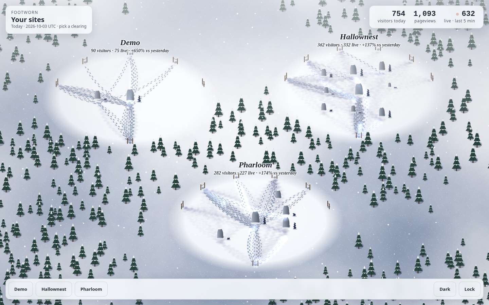
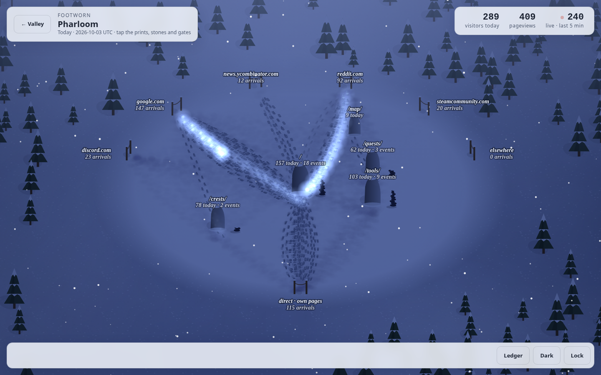
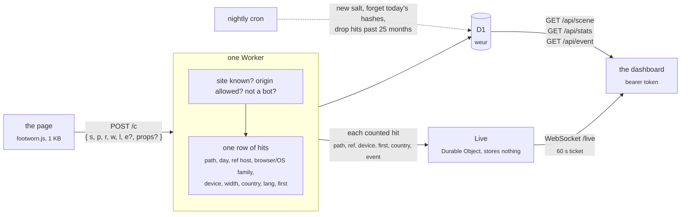

<h1 align="center">Footworn</h1>

<p align="center">
  A visit counter for static sites that sets no cookies, keeps no IP and needs no consent banner.<br>
  One Cloudflare Worker on the free plan: the collector, a 1&nbsp;KB tracker, a D1 database, a JSON API and a live dashboard where every visit leaves footprints in the snow.
</p>

<p align="center">
  <a href="https://github.com/betorzdev/footworn/actions/workflows/ci.yml"></a>
  
  
  
</p>



<p align="center"><sub>The valley: one clearing per site, live. Click one to walk in.</sub></p>

## Why

- **No banner.** Its whole data model is the regulator’s list of what audience measurement may
  keep without consent (Spain’s LSSI 22.2 as the AEPD reads it, the CNIL’s line). No cookies, no
  storage in the browser, no IP, no User-Agent, no fingerprint. [`docs/privacy.md`](docs/privacy.md)
  maps every stored column to that list.
- **A glance, and a show.** Every visit arrives as a line of footprints, the moment it is
  counted: from the gate of the site it came from to the stone of the page it opened. The
  ledger beside it has the plain numbers: totals with their change, a day chart, when people
  come and on what screens, the top of each dimension.
- **Events with properties.** `footworn.event('screen', { view: 'combat', lang: 'es' })` and the
  dashboard breaks it down by day, by page and by each property.
- **Free and tiny.** The Workers Free plan has room for about 50 000 pageviews a day. The
  tracker is 1 KB, the Worker has zero runtime dependencies, the dashboard is a few plain files
  (a 2D canvas, no WebGL) behind a strict CSP: no framework, no build.
- **It never breaks the host page.** Everything the tracker does is inside `try/catch`;
  `sendBeacon` first, `fetch keepalive` after; a hit that isn’t valid is dropped with a silent `204`.

## What you see

**A site, up close.** Each page with traffic is a standing stone, sized by its last 30 days.
Referrers are gates on the edge of the clearing (the top five, then *elsewhere*; *direct* comes
in at the bottom). Every pageview walks from its gate to its stone: a deep print for the first
page of a visitor's day, a light one for the next; bare feet on a phone, trainers on a tablet,
boots on a desktop. An event adds a stone to the page's cairn. Paths used for weeks stay packed
under the fresh snow; footprints are covered in about three hours, and at UTC midnight (the
day's cut) a snowfall clears the field. Hover, or tap, a stone, a gate or a print for its numbers.


**Lit by your clock.** The sun moves the shadows through the day and sets the snow gold at dusk;
at night fresh prints keep a little light, and a visitor walking in carries it.



**The ledger.** A drawer with the numbers behind the scene, for any range: totals with their
change, pageviews and visitors by day, by hour or weekday, screen widths, the top 30 of each
dimension (pages, referrers, events, countries, languages, browsers, systems, devices), and an
event opened with its pages and properties. Every chart has its numbers in a table under `Data`,
which makes the ledger the scene's text alternative too. The view lives in the URL:
`/?site=your-site&ledger=1&days=30&event=screen` is a link straight to it.


**On a phone.** The valley stacks its clearings; drag to look around, pinch to zoom, tap for the
numbers. The panels and the ledger follow the system's light or dark scheme, and the Dark/Light
button overrides it.

<p align="center">
  
</p>

## Wire a site

```html
<script async src="https://footworn.<account>.workers.dev/footworn.js" data-site="your-site"></script>
```

That counts a pageview on load. From the page’s own code:

```js
footworn.event('screen', { view: 'combat', lang: 'es' });   // an action, with up to 10 short properties
footworn.count('/other-page/');                              // a pageview by hand (hash routing, say)
```

The script sends nothing over `file://`, on localhost (unless `data-local="1"`), inside an
iframe, or from a browser driven by automation; `data-auto="0"` skips the pageview on load.
Without the script (blocked, offline) `window.footworn` is undefined, so call it as
`window.footworn && footworn.event(...)`.

The site has to be registered with its allowed origins, or its hits are dropped:

```sh
npm run site:add -- your-site "Your Site" https://your-site.example --remote
```

## How a visit flows



The IP and the User-Agent are read once, to derive browser and OS families and the daily
“first pageview” flag (a SHA-256 of a random daily salt, the site, the IP and the User-Agent,
kept only until midnight), and are never written anywhere.

## Run it locally

```sh
npm install
npm run dev                           # http://localhost:8787
```

`npm run dev` prepares what is missing (a `.dev.vars` with a random token, the local D1, the
`demo` site) and prints the dashboard link with the token; `tools/dev.js` is the recipe.

- `/demo` fires a pageview and has buttons for events.
- `/` is the dashboard. Paste the token from `.dev.vars`, or open `/#token=…` once: it’s saved in
  the browser and the URL is cleaned. The view lives in the query, so `/?site=<id>` or
  `/?site=<id>&ledger=1&from=…&to=…&event=<name>` is a link to it; `&hour=21` fixes the light,
  to see the scene at another time of day. Keep `/demo` open in another tab to watch the hits walk in.
- `/privacy` is the public notice.
- `curl http://localhost:8787/cdn-cgi/local/scheduled` runs the nightly cron by hand.

`npm test` is the unit suite, `npm run smoke` the end-to-end run (a throwaway local D1 through
`wrangler dev`); `.github/workflows/ci.yml` runs both on every push. `.claude/` holds the hooks
that keep the rules in `CLAUDE.md` (tests after every edit under `src/`, no deploys or commits
from the agent, `docs/privacy.md` changes with what is stored) and the skill that runs the app
locally for `/verify`.

## Deploy (once)

1. A Cloudflare account (the Workers Free plan asks for no card) and `npx wrangler login`.
2. `npx wrangler d1 create footworn --location weur` and paste the printed `database_id` into
   `wrangler.toml` (keep `weur`: the data stays in Western Europe).
3. `npm run migrate` (applies `migrations/` to the remote database).
4. `npx wrangler secret put ADMIN_TOKEN` (a long random string; it’s the dashboard’s password).
5. `npm run deploy` → `https://footworn.<account>.workers.dev`.
6. Register each site with `npm run site:add -- <id> "<name>" "<origin> [<origin>…]" --remote`.

Free plan room: 100 000 requests/day and 100 000 D1 writes/day; a pageview costs two writes and
an event one, so about 50 000 pageviews a day. The live view adds one Durable Object request per
counted hit (100 000 a day on the free plan, the same ceiling); an open dashboard's socket
hibernates between hits and costs nothing while idle. The first `npm run deploy` creates the
Durable Object (the `[[migrations]]` in `wrangler.toml`). Retention is `RETENTION_MONTHS` in
`wrangler.toml` (25, the AEPD’s cap).

## Privacy

| Stored, per hit | Why it is allowed |
|---|---|
| `path`, `day` | audience, page by page |
| `ref` (hostname only) | where a link was followed from |
| `browser`, `os`, `device`, `width` | device type, browser and screen size |
| `event`, `props` | actions on the page |
| `country` | geographic area, from the edge |
| `lang` | the browser’s language setting |
| `first` | the daily visitor flag: a count, not an identifier |

Not stored, ever: cookies, local storage, IP, User-Agent, any hash or id, any sequence of pages
one person saw. The live view relays each counted hit to the open dashboards (path, referrer host,
device, first, country, event name) and keeps none of it. `/privacy` is the notice a host site links to;
[`docs/privacy.md`](docs/privacy.md) is the full record, and it changes together with the schema.

<p align="center">
  
</p>

## API

`Authorization: Bearer <ADMIN_TOKEN>`; dates `YYYY-MM-DD`, UTC; default range the last 30 days.

| | |
|---|---|
| `GET /api/sites` | `[{ id, name }]` |
| `GET /api/scene?site=` | what the snowfield draws, all counts: `pages` and `refs` (30-day top 8 and top 5, `[{ value, hits }]`), `wear: [{ ref, path, hits }]` (30 days), `today: { hits, visitors, events, pages: [{ path, hits, events }], refs: [{ ref, hits }] }`, `yesterday: { visitors }` up to this time of day, and `recent: [{ block, path, ref, device, first, hits }]`, today's last 3 hours in 10-minute blocks |
| `GET /api/live-ticket` | `{ ticket }`, good for 60 s, to open the live socket |
| `GET /live?ticket=` | WebSocket: one JSON message per counted hit, `{ site, t, path, ref, device, first, country, event }`; send `ping`, get `pong` |
| `GET /api/stats?site=&from=&to=` | `{ totals: { hits, visitors, events }, days: [{ day, hits, visitors, events }], path, ref, browser, os, device, country, lang, events }`, each dimension `[{ value, hits, visitors }]`, top 30. Also `hours: [{ hour, hits }]` (UTC), `weekdays: [{ weekday, hits }]` (0 is Sunday), `widths: [{ bucket, hits }]` (100 px buckets, pageviews only) and `previous: { from, to, hits, visitors, events }`, the totals of the period of the same length just before. |
| `GET /api/event?site=&name=&from=&to=` | `{ totals, days, paths, props: { key: [{ value, hits }] } }` |
| `POST /c` | what the tracker sends: `{ s, p, r, w, l, e?, props? }`, under 8 KB; always `204` |

## Layout

```
src/index.js      the Worker: /c, /api/*, /live, the nightly cron (export default { fetch, scheduled }, export { Live })
src/collect.js    a posted body → a row of hits (validation, referrer, device, props)
src/ua.js         User-Agent → browser/OS families; the bot filter
src/visitor.js    the daily salt and the "first today" flag
src/stats.js      the API's queries
src/live.js       the live view: what a live message carries, and the Live Durable Object that relays it
src/ticket.js     the live socket's 60-second ticket
src/auth.js       the bearer check
public/           footworn.js, the dashboard (index.html, app.js, scene.js, live.js, ledger.js, theme.js, style.css, tokens.css), privacy, demo,
                  _headers (nosniff and no-referrer everywhere; the dashboard's CSP: no inline code, no framing)
migrations/       the D1 schema
test/             node --test
tools/            dev.js, site-add.js, smoke.js
docs/             privacy.md (the record of what is stored), backlog.md, screenshots/
```
